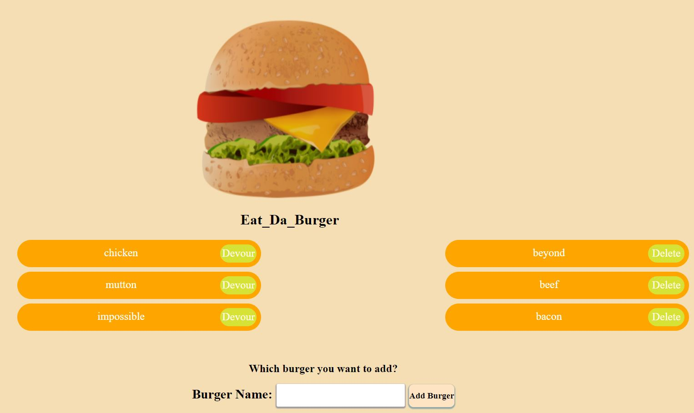

# burgere
##### Burger App (Eat-Da_burger),
is a simple app powereb by
- node, 
- mysql,
- express and 
- express-handlebars.

This have one input from where you can add new burger to the list,
list come with devour button. The devour button is serve as a boolean,
at the first instance it is at the state of false and on click it states change and it moves to the right side of the screen, where it's
devour state is true. When devour state is true then it comes with delete button which allows user to delete the data from database.
On both instance tis app save the data in database with name, id and state of devour i'e true or false.
## How to use
- clone the repo to your computer
- install all dependencies
- create a database with one table with the help of provided schema and seeds.
- and run the server.js file in terminal and open the port that server is listening to.

[Link-to-deployed-app]()
